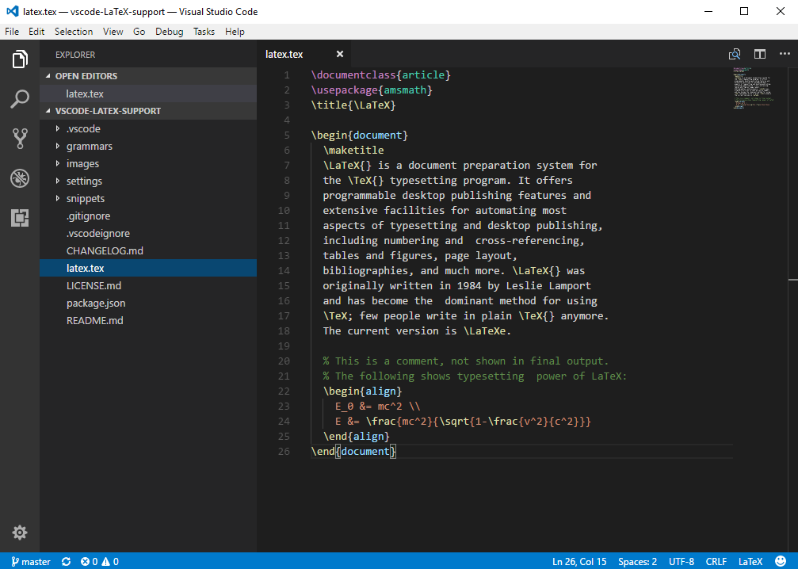

# LaTeX language support for Visual Studio Code

Adds syntax highlighting and snippets for LaTeX.

  

Originally converted from the [LaTeX TextMate bundle](https://github.com/textmate/latex.tmbundle).

Contributions are greatly appreciated. Please fork this repository and open a
pull request to add snippets, make grammar tweaks, etc.
