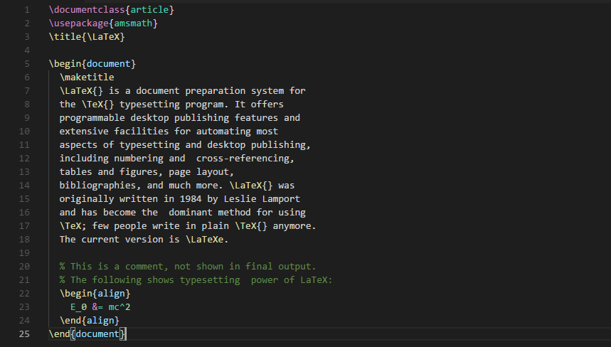

# LaTeX language support for Visual Studio Code

This extension adds syntax highlighting and snippets for LaTeX language. Originally converted from the [LaTeX TextMate bundle](https://github.com/textmate/latex.tmbundle). I developed based on [area/language-latex](https://github.com/area/language-latex) and [James-Yu/LaTeX-Workshop](https://github.com/James-Yu/LaTeX-Workshop).

## Features
* Syntax highlighting for `BibTeX`, `LaTeX` and `TeX` language.
* Folding regions have markers defined: `%Region` and `%Endregion`.
* Snippets.

## Changelog

Read the [CHANGLELOG](https://github.com/ProAdd-ons/vscode-LaTeX-support/blob/master/CHANGELOG.md) to know what has changed over the last few versions of this extension.

## Contributing

Contributions are greatly appreciated. Please fork this repository and open a
pull request to add snippets, make grammar tweaks, etc.

## License

Licensed under the [MIT](LICENSE.md) License.
